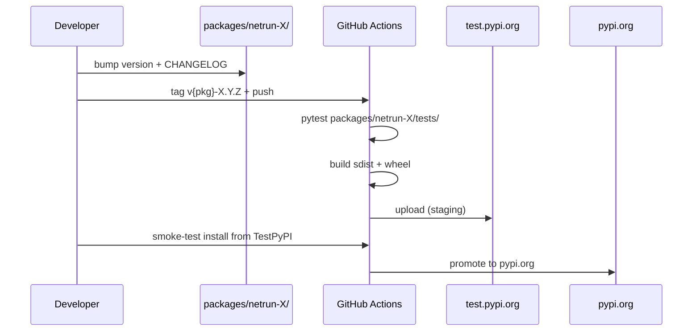

# netrun-oss — Architecture

Public Python OSS monorepo. 19 production-tested packages on PyPI under the `netrun.*` PEP 420 namespace (v2.0+) for FastAPI applications and adjacent infrastructure. MIT licensed. Plus `netrun-touch-ui` (TypeScript, not in the Python namespace).

## Package inventory (grep-verified 2026-05-19)

19 Python packages in `packages/`, each with its own `setup.py` / `pyproject.toml` and PyPI release. Latest is `netrun-dee 1.0.0` (May 1, 2026).

```mermaid
flowchart TB
  subgraph Core["Core namespace"]
    Core_p[netrun-core 2.0.0<br/>PEP 420 root]
  end

  subgraph Auth["Auth & authorization"]
    Auth_p[netrun-auth 2.0.0<br/>JWT · OAuth2 · Azure AD · Casbin]
    OAuth_p[netrun-oauth 2.0.0<br/>12+ providers]
    RBAC_p[netrun-rbac 3.0.0<br/>multi-tenant · escape-path scanner]
  end

  subgraph Data["DB & cache"]
    DBPool[netrun-db-pool 2.0.0<br/>async pool · tenant isolation]
    Cache_p[netrun-cache 1.0.0<br/>Redis + in-memory]
  end

  subgraph Web["Web middleware"]
    CORS_p[netrun-cors 2.0.0]
    Rate_p[netrun-ratelimit 2.0.0<br/>token bucket + Redis]
    WS_p[netrun-websocket 1.0.0<br/>Redis sessions + JWT]
    Errors_p[netrun-errors 2.0.0]
  end

  subgraph Ops["Ops & observability"]
    Config_p[netrun-config 2.0.0<br/>Azure Key Vault + TTL]
    Env_p[netrun-env 2.0.0<br/>schema validator]
    Log_p[netrun-logging 2.0.0<br/>structlog + App Insights]
    Resil_p[netrun-resilience 1.0.0<br/>retry · CB · timeout · bulkhead]
    Val_p[netrun-validation 1.0.0<br/>pydantic validators]
  end

  subgraph LLM["LLM & AI"]
    LLM_p[netrun-llm 2.0.0<br/>multi-provider · policy · telemetry]
    Dee_p[netrun-dee 1.0.0<br/>Digital Emotion Equivalents<br/>39 personality profiles + ECI]
  end

  subgraph Test["Testing"]
    Test_p[netrun-pytest-fixtures 2.0.0]
    Dog_p[netrun-dogfood 2.0.0<br/>internal MCP server]
  end

  Auth_p -.-> Core_p
  OAuth_p -.-> Core_p
  RBAC_p -.-> Core_p
  DBPool -.-> Core_p
  Cache_p -.-> Core_p
  CORS_p -.-> Core_p
  Rate_p -.-> Core_p
  WS_p -.-> Core_p
  Errors_p -.-> Core_p
  Config_p -.-> Core_p
  Log_p -.-> Core_p
  LLM_p -.-> Core_p
  Dee_p -.-> Core_p

  classDef core fill:#fef,stroke:#a8a;
  class Core_p core;
```



## v2.0 namespace migration

```python
# v2.x — recommended
from netrun.auth import JWTHandler, require_permission
from netrun.config import SecretCache
from netrun.logging import get_logger
from netrun.llm import LLMFallbackChain
from netrun.rbac import TenantContext, TenantTestContext

# v1.x compatibility — still works, deprecation warning, removed in v3.0
from netrun_auth import JWTHandler
```

All packages migrated to PEP 420 namespace packages. Each package independently versioned; releases are not lockstep.

## Soft-dependency detection

Optional integrations (Azure, OpenAI, Anthropic, Redis) raise clear errors when their packages aren't installed:

```
ImportError: AzureADIntegration requires 'azure-identity'.
Install with: pip install netrun-auth[azure]
```

## Publish flow



`packages/RELEASE_NOTES_v2.0.0.md` and `packages/CHANGELOG_v2.0.0.md` track the per-package status.

## Key v2.1 / v3.0 capabilities

- **netrun-llm**: per-tenant `TenantPolicy` (monthly + daily budget, allowed models, cost tier limit, rate-limit RPM), `PolicyEnforcer.validate_request(...)`, `LLMTelemetry.record_request(...)`, automatic fallback chain (Claude → OpenAI → Ollama). Azure OpenAI and Gemini adapters added in v2.1.
- **netrun-rbac v3.0**: hierarchical teams, resource-level sharing (user / team / tenant / external), `TenantQueryService` for auto-filtered CRUD, hybrid isolation (Postgres RLS + application-level), `TenantTestContext` contract testing, `TenantEscapePathScanner` for CI/CD that fails the build on SQL-without-tenant-filter findings, SOC2/ISO27001/NIST compliance docs.
- **netrun-cache, netrun-resilience, netrun-validation, netrun-websocket**: four infrastructure packages added in v2.1.

## netrun-dee — Digital Emotion Equivalents

Published May 1, 2026. Emotion detection and ECI (Emotional Complexity Index) scoring for AI-generated text, with 39 personality profiles. Used in Charlotte's voice tier for response shaping and in Intirkast for podcast persona consistency. No runtime deps beyond stdlib + `pydantic`.

## Companion repos

- `netrun-shared-ts` — TypeScript equivalents for Netrun internal services (16 packages, not published to npm)
- The OSS / closed split is intentional: Python packages are general-purpose enough for community use; TypeScript packages are tightly coupled to Netrun-specific architectures.
